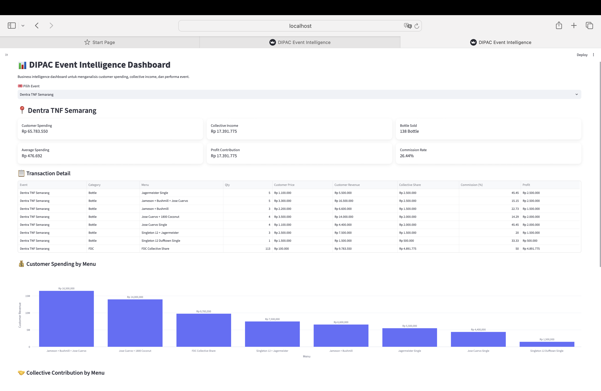
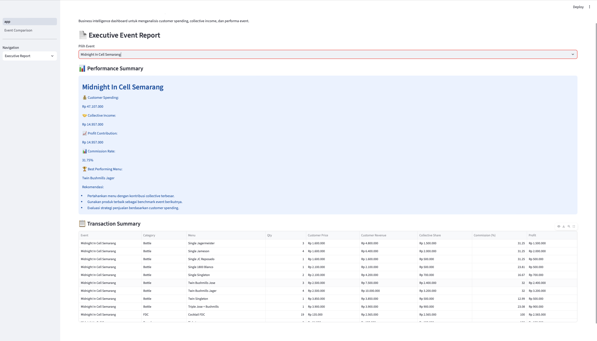
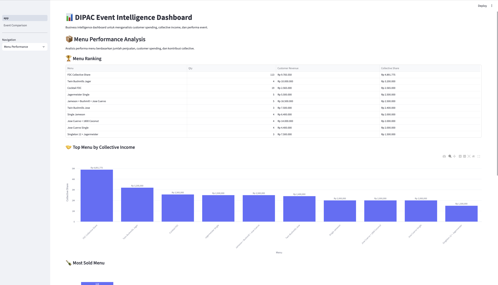
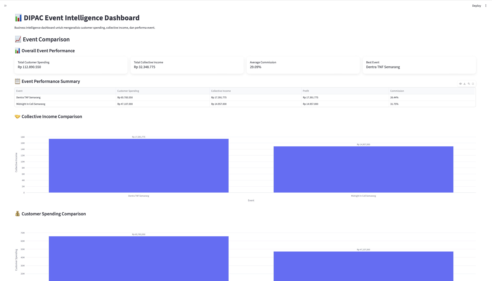

# 📊 DIPAC Event Intelligence Dashboard
Business Intelligence dashboard for analyzing event sales performance, customer spending behavior, collective revenue contribution, and automated executive reporting.

python
streamlit
business-intelligence
data-analytics
pandas
plotly
dashboard
data-visualization



## Overview

DIPAC Event Intelligence Dashboard is a Business Intelligence application designed to analyze event sales performance, customer spending behavior, collective revenue contribution, and menu profitability.

The dashboard transforms raw event transaction data into actionable business insights through interactive visualization, performance analytics, and automated executive reporting.

---

# 🚀 Key Features

## 1. Event Performance Analysis

Analyze multiple events and compare their business performance:

- Customer spending
- Collective income
- Profit contribution
- Commission rate
- Transaction performance


## 2. Executive Event Report

Generate automated business reports containing:

- Event performance summary
- Best performing menu
- Revenue contribution analysis
- Transaction summary
- PDF executive report


Example output:




## 3. Menu Performance Analytics

Identify products with the highest contribution:

- Top performing menu
- Collective share ranking
- Product contribution analysis





## 4. AI Business Insight

The dashboard provides automated analytical recommendations based on:

- Collective contribution ratio
- Revenue performance
- Product performance


Example insight:

> Event performance evaluation and strategic recommendations generated automatically from transaction patterns.


## 5. Event Comparison Dashboard

Compare multiple events to understand:

- Revenue differences
- Product trends
- Customer spending behavior




---
# 🏗️ Project Structure

dipac-event-analytics/

│
├── app.py                         # Main Streamlit dashboard
├── requirements.txt               # Python dependencies
├── README.md                      # Project documentation
├── .gitignore                     # Ignore unnecessary files
│
├── data/
│   └── events/
│       ├── jakarta_stalk_white_party/
│       │   └── transactions.csv
│       │
│       ├── semarang_dentra_tnf/
│       │   └── transactions.csv
│       │
│       └── semarang_midnight_cell/
│           └── transactions.csv
│
├── utils/
│   ├── __init__.py
│   ├── analytics.py               # KPI calculation & menu analysis
│   ├── event_comparison.py        # Multi-event comparison
│   ├── forecasting.py             # Revenue forecasting
│   └── pdf_report.py              # Executive PDF generator
│
├── screenshots/
│   ├── dashboard.png
│   ├── executive-report.png
│   ├── comparison.png
│   └── menu-performance.png
│
└── docs/
    ├── Dentra_TNF_Report.pdf
    ├── Midnight_In_Cell_Report.pdf
    └── White_Party_Report.pdf

---

# 🛠️ Technology Stack

## Programming Language

- Python


## Data Processing

- Pandas


## Visualization

- Plotly
- Streamlit


## Reporting

- FPDF


## Analytics Approach

- KPI Analysis
- Revenue Contribution Analysis
- Product Ranking
- Business Insight Generation

---

# 📄 Executive Report Sample

Generated PDF reports are available:

📌 [Dentra TNF Semarang Executive Report](docs/Dentra_TNF_Semarang_Report.pdf)


---

# 📈 Business Metrics

The dashboard evaluates:

| Metric | Description |
|---|---|
| Customer Spending | Total customer transaction value |
| Collective Income | Revenue contribution from collective sales |
| Profit Contribution | Estimated profit contribution |
| Commission Rate | Collective revenue percentage |
| Best Menu | Highest performing product |


---

# ▶️ Installation

Clone repository:

```bash
git clone https://github.com/Brabus03/dipac-event-analytics.git

👨‍💻 Author

Brabus03
